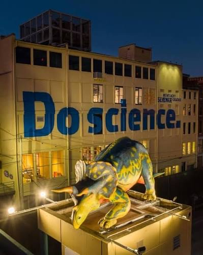

### Logistics & lodging

#### Traveling to Louisville
The Kentucky Science Center is located in downtown Louisville KY. If flying, we recommend flying into the Muhammad Ali International Airport (SDF); other major airports in Cincinnati, Indianapolis, and Nashville are all several hours drive away with no train service.

#### Hotels
There are many excellent hotels within easy walking distance of the venue. We have block rate agreements with the following hotels:

| Hotel | Address | Dist. from KYSC | Nightly Rate | Booking Method |
|-------|------|------|------|------|
| The Grady Hotel | 601 W Main St. | 0.1 mi. | $155 | [Book through this link.](https://www.bookonthenet.net/east/premium/eresmain.aspx?id=c9I9UIZ3Up7r4tFRHzVt%2bEslIxnEs1AXauptE2h3zZQ%3d&arrival_date=2026-04-13&stay_nights=3&promo_code=PSC) |
| Homewood Suites | 635 W Market | 0.2 mi. | $149 | [Book through this link.](https://www.hilton.com/en/book/reservation/deeplink/?ctyhocn=LOUDTHW&groupCode=CHWPSC&arrivaldate=2026-04-13&departuredate=2026-04-16&cid=OM,WW,HILTONLINK,EN,DirectLink&fromId=HILTONLINKDIRECT) |
| EconoLodge | 401 S 2nd St. | 0.8 mi. | \$70 (+\$8 parking) | [Book through this link.](https://www.choicehotels.com/reservations/groups/QM83U9) |

#### Venue
PSCW will be held on the 4th floor of the Kentucky Science Center (pictured below). The address is 727 W Main St, Louisville KY.

The venue is handicap accessible. There will be free parking for PSCW attendees in the KYSC parking lot.

There are a lot of power outlets and (probably) sufficient wifi capacity.

There will be coffee service in the morning (with breakfast) and in the early afternoon each day.

We will be providing breakfast catering every day. We are planning to provide boxed lunches on the first day (only). Please specify dietary restrictions in the registration form or contact the organizers if your situation changes.

~~We are looking into options for childcare.~~ We looked into this and will not be able to provide childcare support.

____
There _might_ be affiliated after hours social / networking events as well, but this will be determined much closer to the workshop.