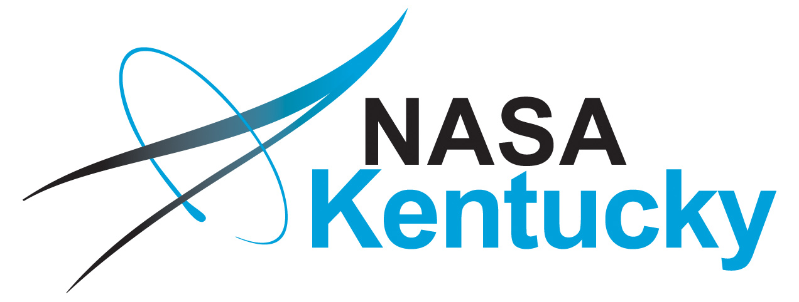

### Organizers & SOC

---

#### Organizers

The co-organizers of PSCW are Chase Million ([Million Concepts](https://millionconcepts.com/), [OpenPlanetary](https://www.openplanetary.org/)) and Paul Byrne (Washington University in St. Louis).

They can be reached directly at chase@millionconcepts.com and paul.byrne@wustl.edu.

The contact email for PSCW matters, which is most likely to recieve a timely response, is contact@planetaryworkshop.org.

---

#### Partners

| [Million Concepts]((https://millionconcepts.com/)) | [OpenPlanetary](https://www.openplanetary.org/) | [NASA Kentucky Program](https://nasa.engr.uky.edu/space-grant/) | [Planetary Research Cooperative](https://coop.planetary-research.org/) | 
| --- | --- | --- | --- |
|  |  |  | |

PSCW is being developed as a joint partnership between Million Concepts, OpenPlanetary, the Planetary Research Cooperative, and independent community members. Specific thanks go to Ingrid Dauber, Tanya Harrison, Mark Wieczorek, Leah Wasser, and Tom Stein.

---

#### Science Organizing Committee

We are seeking 8 members for the Science Organizing Committee (SOC). Members will be announced here by the end of January. If you are interested in volunteering to serve on the SOC, please indicate your interest when registering for the event.

---

**Acknowledgements**

* Cover photo is Armillary sphere (Antonio Santucci, 1588-1593). Galileo museum, Florence. Photo by Chase Million.
* Favicon and logo is [Martian canals depicted by Percival Lowell](https://en.wikipedia.org/wiki/Martian_canals#/media/File:Lowell_Mars_channels.jpg).